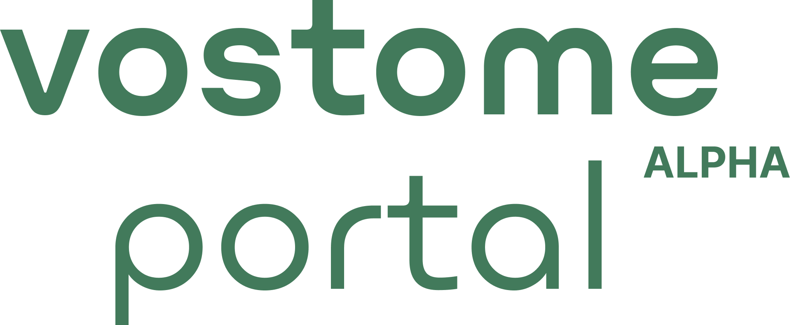

### **Summary**
Vostome Portal is an original portfolio project by [Perry Asibey-Bonsu](https://www.linkedin.com/in/pasibey/). It is a simple form builder and submissions manager built with:

- [Next.js](https://nextjs.org/)
- [TailwindCSS](https://tailwindcss.com/)
- [Storybook](https://storybook.js.org/)
- [Supabase](https://supabase.com/)

### **Skills** 
The product development skills implemented in the assembly of this project include:

1. **Concept Ideation**: This project was inspired by my experience using similar form builders and submissions managers and I decided to build a stripped-down version of these tools to identify their most valuable functions.

2. **UI Design**: I designed the user interface with Figma. I thought through theming, component layout, and user interaction flows. The original design file, which has a more expanded app concept, is available for viewing [here](https://www.figma.com/file/3ToSpGzBy93DoU3gUodAjC/Portal-Platform-Design?node-id=0%3A1).

3. **Frontend Development**: I built the UI components in isolation with Storybook. It was my first time using Storybook for a project and, though I am not a fan of the dependency vulnerabilities it introduced to the project, I would use it again for the speed of working with isolated components. (Note: Storybook was removed in the end but it is visible in prior commits.)

3. **Backend Development**: Previous versions of this project included an API for controlled access to database records. However, after realizing the Supabase client automatically handled user authentication on each request I removed the API directory.

### **Data Model**
The most important components of this project are Submissions, Fields, and Portals.

Submissions describe collected form data, they have a many-to-one relationship with Portals. The model for a Submission is:
```
    id: string;
    portal_id: string;
    created_on: string;
    fields: {
        [key: string]: string;
    };
    portal_owner_id: string;
    portals?: {
        name: string
    }
```

Portals are forms that collect data, they have a one-to-many relationship with Submissions. The model for a Portal is:

```
    id: string;
    name: string;
    desc: string;
    created_on: Date;
    owner_id: string;
    fields: Field[]
```

Fields describe the input fields on a form and how they should be displayed. A Portal can have multiple Fields, each Field has a unique ID.
```
    id: number;
    label: string;
    type: string;
    required: boolean;
    options: string[] | null;
```

### **How To Use The App**
The easiest way to use the app is to view it [online](https://portal.vostome.com). I recommend you access this on a desktop or laptop screen because responsive sizing was not implemented. You will have to create a user account.

> Feel free to use a fake email address. You won't need to verify it and accounts will be routinely deleted.

The other away to use the app would be to run it locally. Here is a good way to go about that:

1. Clone the repository with the command
```
git clone https://github.com/dev-perry/portal-web.git 
```
2. [Create a Supabase account](https://app.supabase.com/) and place your credentials in a `.env` file at the project root-level
```
NEXT_PUBLIC_SUPABASE_URL=PutYourURLHere
NEXT_PUBLIC_SUPABASE_ANON_KEY=PutYourKeyHere
```
3. Install the necessary dependencies with the command
```
npm install
```
4. Run the project with the command
```
npm run dev
```

### **Points for Improvement**
Since this is a portfolio project, I see a lot of opportunities for improvement. If I were to continue working on it I would add:

- Input validation on form fields
- File upload and storage
- Remote bug reporting
- Improved loading state management
- Portal link shortening for easier sharing
- Expandable submission viewing panel
- Shared team accounts
- Summary analytics

...and so much more

### **About Me**
I am a tinkerer. I like to figure out how things work and smash together apples and oranges to make weird juice. You can see some of my other concepts [here](https://portfolio.perryasibeybonsu.com/).